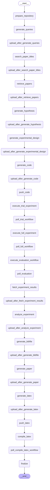

# Backend

## Build API server

```bash
uv run uvicorn api.main:app --host 0.0.0.0 --port 8000 --log-level debug --reload
```

## E2E workflow



```mermaid
---
config:
  flowchart:
    curve: linear
---
graph TD;
        __start__([<p>__start__</p>]):::first
        prepare_repository(prepare_repository)
        generate_queries(generate_queries)
        search_paper_titles(search_paper_titles)
        retrieve_papers(retrieve_papers)
        generate_hypothesis(generate_hypothesis)
        generate_experimental_design(generate_experimental_design)
        generate_code(generate_code)
        push_code(push_code)
        execute_trial_experiment(execute_trial_experiment)
        poll_trial_workflow(poll_trial_workflow)
        execute_full_experiment(execute_full_experiment)
        poll_full_workflow(poll_full_workflow)
        execute_evaluation_workflow(execute_evaluation_workflow)
        poll_evaluation(poll_evaluation)
        fetch_experiment_results(fetch_experiment_results)
        analyze_experiment(analyze_experiment)
        generate_bibfile(generate_bibfile)
        generate_paper(generate_paper)
        generate_latex(generate_latex)
        push_latex(push_latex)
        compile_latex(compile_latex)
        poll_compile_latex_workflow(poll_compile_latex_workflow)
        finalize(finalize)
        upload_after_generate_code(upload_after_generate_code)
        upload_after_generate_paper(upload_after_generate_paper)
        upload_after_generate_queries(upload_after_generate_queries)
        upload_after_search_paper_titles(upload_after_search_paper_titles)
        upload_after_retrieve_papers(upload_after_retrieve_papers)
        upload_after_generate_bibfile(upload_after_generate_bibfile)
        upload_after_generate_hypothesis(upload_after_generate_hypothesis)
        upload_after_generate_experimental_design(upload_after_generate_experimental_design)
        upload_after_generate_latex(upload_after_generate_latex)
        upload_after_analyze_experiment(upload_after_analyze_experiment)
        upload_after_fetch_experiment_results(upload_after_fetch_experiment_results)
        __end__([<p>__end__</p>]):::last
        __start__ --> prepare_repository;
        analyze_experiment --> upload_after_analyze_experiment;
        compile_latex --> poll_compile_latex_workflow;
        execute_evaluation_workflow --> poll_evaluation;
        execute_full_experiment --> poll_full_workflow;
        execute_trial_experiment --> poll_trial_workflow;
        fetch_experiment_results --> upload_after_fetch_experiment_results;
        generate_bibfile --> upload_after_generate_bibfile;
        generate_code --> upload_after_generate_code;
        generate_experimental_design --> upload_after_generate_experimental_design;
        generate_hypothesis --> upload_after_generate_hypothesis;
        generate_latex --> upload_after_generate_latex;
        generate_paper --> upload_after_generate_paper;
        generate_queries --> upload_after_generate_queries;
        poll_compile_latex_workflow --> finalize;
        poll_evaluation --> fetch_experiment_results;
        poll_full_workflow --> execute_evaluation_workflow;
        poll_trial_workflow --> execute_full_experiment;
        prepare_repository --> generate_queries;
        push_code --> execute_trial_experiment;
        push_latex --> compile_latex;
        retrieve_papers --> upload_after_retrieve_papers;
        search_paper_titles --> upload_after_search_paper_titles;
        upload_after_analyze_experiment --> generate_bibfile;
        upload_after_fetch_experiment_results --> analyze_experiment;
        upload_after_generate_bibfile --> generate_paper;
        upload_after_generate_code --> push_code;
        upload_after_generate_experimental_design --> generate_code;
        upload_after_generate_hypothesis --> generate_experimental_design;
        upload_after_generate_latex --> push_latex;
        upload_after_generate_paper --> generate_latex;
        upload_after_generate_queries --> search_paper_titles;
        upload_after_retrieve_papers --> generate_hypothesis;
        upload_after_search_paper_titles --> retrieve_papers;
        finalize --> __end__;
        classDef default fill:#f2f0ff,line-height:1.2
        classDef first fill-opacity:0
        classDef last fill:#bfb6fc
```
