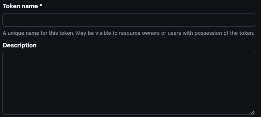
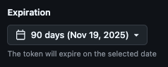
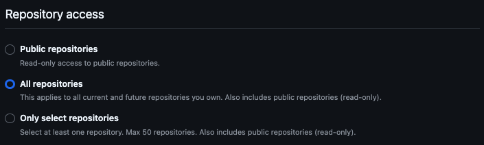
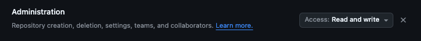
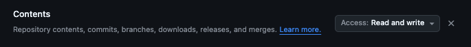

## GitHub personal access token

This section summarizes how to configure the GitHub personal access token required to run AIRAS. Please prepare a GitHub account to issue the token.

- Set any Token name you prefer.

    

- Select the account that will create repositories.

    

- Set an expiration period of less than 365 days. GitHub personal access tokens with an expiration period of more than 365 days cannot be used to fork repositories from other accounts.

    

- Select "All repositories".

    

- Grant the following permissions to the token.

    
    
    

For more details, please refer to [this link](https://docs.github.com/en/authentication/keeping-your-account-and-data-secure/managing-your-personal-access-tokens#creating-a-fine-grained-personal-access-token).
