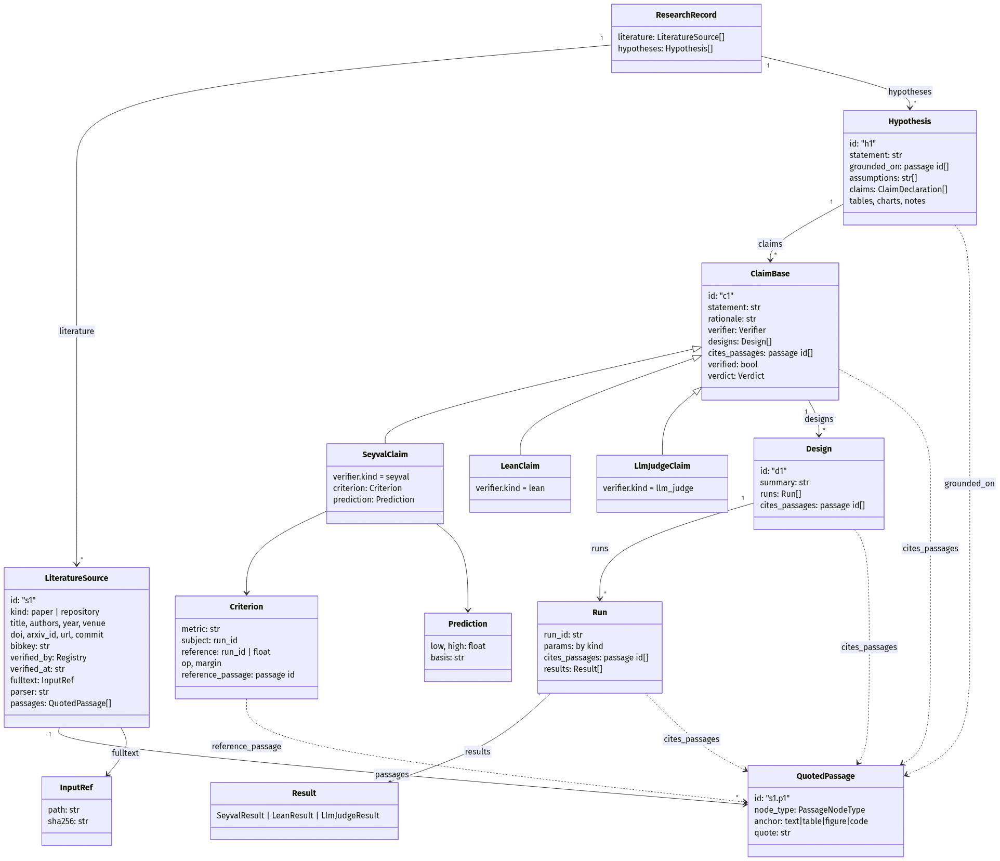
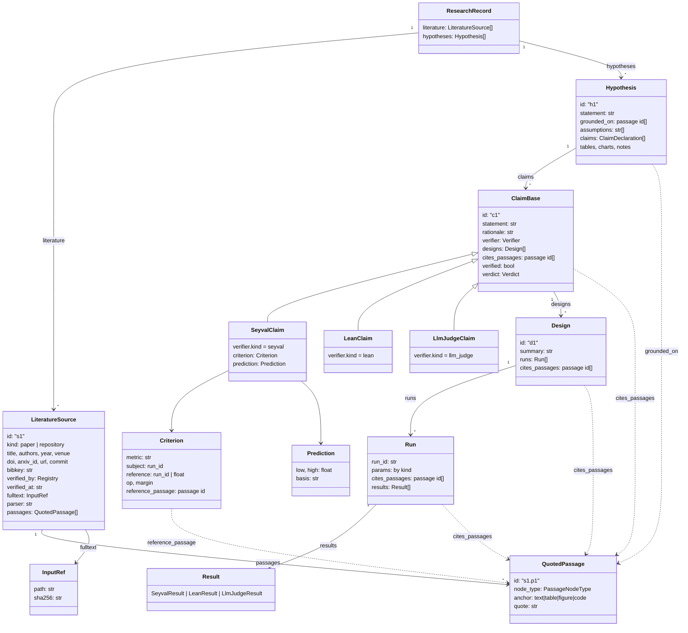

# record.json の構造

`.research/record.json` は二つの木を持つ。右半分は「この仮説を支えるにはこれらの claims、この claim を検証するにはこれらの designs、design はこれらの runs」、左半分は「この研究が依拠した文献（literature）と、そこから逐語で引いた箇所（passages）」。仮説・claim・design・run は passage の id で文献に結ばれる。エージェントが書くのは宣言（declaration）だけで、`verified` / `verdict` / `results[]` と、文献のスナップショット・実在確認は機械が書く。record は append-only で、宣言の書き換えは同 id の再 append として履歴に残る。

## クラス図



<!-- 下の mermaid を Kroki (https://kroki.io, output_format png,
     diagram_options {"html-labels": "false"}) で描画したもの（白背景、1924 px 幅）。
     箱の中は名前と型だけで、各フィールドの意味は「木構造」節にある。図を変えたら描画し直す。 -->



## 論理構造

- claims は集合として仮説を含意する: `c1 ∧ c2 ∧ … ∧ cn ⇒ H`
- `claims[].rationale`: この claim がその集合の元である理由（H のどの部分を、なぜ支えるか）
- `hypotheses[].assumptions`: 含意が成り立つために認める必要のある公理。全 claim が支持されても未検証として残るのはちょうどこれ
- `claims[].verdict`: `c_i` を仮定として置いてよいか

## 文献の検査

出どころ（airas-papers-db、エージェントの Web 検索、リポジトリ）に関係なく、gate は全 source に同じ検査をかける。

| 検査 | 内容 |
| --- | --- |
| 実在 | `verified_by` が空でない（登録時に airas_db の引き当て、doi.org の解決、arXiv API、`git fetch` のいずれかが確認） |
| スナップショット | `fulltext.path` が存在し sha256 が一致 |
| 逐語 | 全 passage の `quote` が snapshot の部分文字列（NFKC・空白正規化、合字・改行・ソフトハイフンは無視） |
| 参照解決 | `grounded_on` / `cites_passages` / `reference_passage` の id が既知の passage |
| 時系列 | 宣言を含む各コミットで、その宣言が名指す passage が既に record にある（後から登録した passage を根拠にできない） |
| 引用（verify_paper） | main.tex の `\cite` の鍵が登録済み bibkey、`\cite[s1.p2]{key}` の locator がその source の passage、references.bib が再生成と一致。引かれなかった source は `uncited_sources` として報告（失敗ではない） |

## 木構造

- **literature[]** 依拠した文献。`register_sources` が書く
  - `id` `"s1"`, `"s2"`, …
  - `kind` `"paper"` / `"repository"`
  - `title` / `authors[]` / `year` / `venue`
  - `doi` / `arxiv_id` / `url`。repository は `url` と `commit`
  - `bibkey` `\cite` の鍵（`<surname>-<year>-<word>`）。`references.bib` はここから再生成
  - `verified_by` / `verified_at` 登録時に実在を確認したレジストリと時刻。凍結
  - `fulltext` `{path, sha256}` `.research/sources/<id>/fulltext.txt`。論文はページを form feed 区切り、repository は 1 ファイル 1 ページ（`==> path <==` 見出し）
  - `parser` 抽出器（`pymupdf 1.26` / `git show`）
  - **passages[]** 引いた箇所。`append_to_record(source_id, passages)` で追記
    - `id` `"s1.p1"`, `"s1.p2"`, …
    - `node_type` `claim` / `result` / `method` / `setup` / `gap` / `definition`。何を述べる箇所か（グラフ探索はここで絞る）
    - `anchor` `text` / `table` / `figure` / `code`。どこにあるか。既定 `text`
    - `quote` fulltext.txt からの逐語コピー
- **hypotheses[]** 仮説の一覧
  - `id` `"h1"`, `"h2"`, …
  - `statement` 仮説そのもの（散文）
  - `grounded_on[]` 動機となった passage id（先行研究の gap）。既定は空
  - `assumptions[]` `c1 ∧ … ∧ cn ⇒ H` を成り立たせる公理。各項目に関わる claim id を書く。既定は空
  - **claims[]** 仮説を検証可能な主張に分解したもの。`verifier.kind` で型が決まる
    - 共通（ClaimBase）
      - `id` `"c1"`, `"c2"`, …
      - `statement` 一文の主張。verdict が付く対象
      - `rationale` この claim が成り立つと、なぜ・仮説のどの部分が支えられるか。必須
      - `verifier` 何が検証するか。必須。一つの claim に一つ（証明と実験の両方が要るなら claim を二つに分ける）
      - `cites_passages[]` 依拠する passage id。既定は空
      - `designs[]` 実験・証明・判定の構成
      - `verified` 配下の全 run に verifier のレポートがあるか。false → true のみ
      - `verdict` `"supported"` / `"refuted"` / `"inconclusive"`。未設定 → 設定の一回限り。再実行で反転した場合は gate が drift として報告
    - **[kind = seyval]** 実験
      - `verifier` `{kind: "seyval"}`
      - `criterion` 反証線。宣言時必須、凍結
        - `metric` metrics.json 内のパス（例 `"accuracy"`, `"loss.final"`）
        - `subject` 判定対象の run_id
        - `reference` 比較対象の run_id（同じ metric）または定数
        - `op` `">="` / `"<="` / `">"` / `"<"`
        - `margin` 既定 0.0。意味は `(subject.metric − reference) op margin`。境界は一致扱い
        - `reference_passage` `reference` が定数のとき、その値を読んだ passage id
      - `prediction` 予測区間。宣言時必須、凍結
        - `low` / `high` `low < high`（点は不可）
        - `basis` 根拠（prior work, pilot など）
      - `verdict` verified 時に criterion を runs の metrics に適用して導出。metric が解決できなければ `inconclusive`
      - **designs[]**
        - `id` / `summary` / `cites_passages[]`
        - **runs[]** 実行単位。`.research/results/<run_id>/` を生む
          - `run_id` / `description` / `cites_passages[]`
          - `params` dispatch 条件（自由 dict、例 `{"mode": "full"}`）。基盤の記録と照合される
          - **results[]** metrics.json と provenance manifest から機械が追記
            - `id` Seyval の実行 id
            - `commit` 実行したコミット
            - `metrics` metrics.json そのまま
            - `eval_inputs` `{path, sha256}` airas-eval への入力
            - `eval_report` airas-eval の評価レポート（task_type, metrics, versions, skipped …）
    - **[kind = lean]** 証明
      - `verifier` `{kind: "lean", toolchain, mathlib_rev, allowed_axioms[]}`
      - `verdict` `"supported"` / `"inconclusive"`。Lean は反証しない
      - **designs[]**
        - `id` / `summary`
        - **runs[]** 1 run = 1 宣言
          - `run_id` / `description`
          - `params` `{module, decl, statement}`。statement は `#check @decl` が出す型
          - **results[]** lean.json から（`make run` が `lake exe airas-report` で書く）
            - `id` backend の実行 id（provenance manifest から）
            - `commit`
            - `toolchain` / `mathlib_rev` 実際にビルドした版。verifier の宣言と一致しなければ error
            - `statement` 実際にビルドされた宣言の型
            - `statement_matches` 宣言した statement を項として比較した結果（report ツールが判定。無ければ error）
            - `axioms[]` 宣言が依存する公理（`sorryAx` を含む）
            - `errors[]` ビルド失敗 / sorry / statement 不一致 / module・decl・toolchain・mathlib_rev の不一致 / 許可外公理
            - `warnings[]`
    - **[kind = llm_judge]** 判定
      - `verifier` `{kind: "llm_judge", model, rubric, temperature, samples}`
      - `verdict` `"supported"` / `"refuted"` / `"inconclusive"`。全票一致で supported
      - **designs[]**
        - `id` / `summary`
        - **runs[]** 1 run = 1 判定
          - `run_id` / `description`
          - `params` `{evidence[]}` リポジトリ内パス
          - **results[]** judgment.json から
            - `id` provider 側の応答 id
            - `commit`
            - `inputs_sha256` rubric + evidence + statement + model の hash
            - `verdict`
            - `errors[]` / `warnings[]`
  - **tables[]** 論文の表の宣言（`tables/<key>.tex` に描画）
  - **charts[]** 図の宣言（Vega-Lite spec、`metric:` 参照のみ）
  - `notes[]` 自由記述

## 論文への描画

| 生成物 | 元 | 段階 |
| --- | --- | --- |
| `claims.tex` | claims の statement / rationale / criterion / prediction / observed / verdict と hypothesis の assumptions。`grounded_on` / `cites_passages` の id と、末尾に Sources（各 source の bibkey・題名と passage の逐語引用） | prereg から（未着は pending） |
| `references.bib` | literature[]（bibkey ごとに 1 エントリ） | register_sources 時 |
| `values.tex` | `\airasval{<run_id>.<metric>}` の値 | results 以降 |
| `tables/<key>.tex` | tables[] | results 以降 |

いずれも gate が record から再生成して byte 比較するため、手編集は検出される。

## 例（seyval）

```json
{
  "literature": [{
    "id": "s1",
    "kind": "paper",
    "title": "Dropout: A Simple Way to Prevent Neural Networks from Overfitting",
    "authors": ["Nitish Srivastava", "Geoffrey Hinton"],
    "year": 2014,
    "venue": "JMLR",
    "url": "https://jmlr.org/papers/v15/srivastava14a.html",
    "bibkey": "srivastava-2014-dropout",
    "verified_by": "airas_db",
    "verified_at": "2026-09-15T09:00:00+00:00",
    "fulltext": {"path": ".research/sources/s1/fulltext.txt", "sha256": "…"},
    "parser": "pymupdf 1.26.0",
    "passages": [
      {"id": "s1.p1", "node_type": "gap",
       "quote": "it is not clear how to choose the dropout rate for very deep networks"},
      {"id": "s1.p2", "node_type": "result", "anchor": "table",
       "quote": "Dropout improves test error on CIFAR-10 from 15.60 to 12.61"}
    ]
  }],
  "hypotheses": [{
    "id": "h1",
    "statement": "提案する正則化項は画像分類 CNN の汎化性能を改善する。",
    "grounded_on": ["s1.p1"],
    "assumptions": [
      "test accuracy の差が汎化性能の差を表す (c1, c2)",
      "CIFAR-10 と CIFAR-100 で成り立てば画像分類 CNN 一般で成り立つ (c1, c2)",
      "ResNet-18 が CNN の代表として十分 (c1, c2)"
    ],
    "claims": [{
      "id": "c1",
      "statement": "CIFAR-10 で提案手法の test accuracy が ResNet-18 を 1.0 pt 以上上回る。",
      "rationale": "汎化性能の代理指標として test accuracy を、代表的 CNN として ResNet-18 を用いた直接比較。",
      "cites_passages": ["s1.p2"],
      "verifier": {"kind": "seyval"},
      "criterion": {"metric": "accuracy", "subject": "proposed-resnet18-cifar10",
                    "reference": "comparative-1-resnet18-cifar10", "op": ">=", "margin": 0.01},
      "prediction": {"low": 0.02, "high": 0.04, "basis": "pilot run on 10% of the data"},
      "designs": [{
        "id": "d1", "summary": "同一データ・同一予算での直接比較",
        "runs": [
          {"run_id": "proposed-resnet18-cifar10", "params": {"mode": "full"}},
          {"run_id": "comparative-1-resnet18-cifar10", "params": {"mode": "full"}}
        ]
      }]
    }]
  }]
}
```
