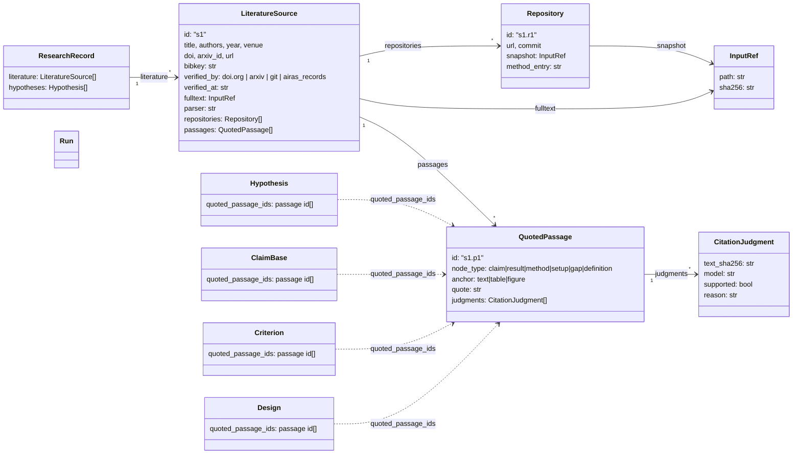

# record.json の構造

`.research/record.json` は二つの木を持つ。右半分は「この仮説を支えるにはこれらの claims、この claim を検証するにはこれらの designs、design はこれらの runs」、左半分は「この研究が依拠した文献（literature）と、そこから逐語で引いた箇所（passages）」。仮説・claim・design・run は passage の id で文献に結ばれる。エージェントが書くのは宣言（declaration）だけで、`verified` / `verdict` / `results[]` と、文献のスナップショット・実在確認は機械が書く。record は append-only で、宣言の書き換えは同 id の再 append として履歴に残る。

## クラス図

<!-- 2 枚とも下の mermaid を Kroki (https://kroki.io, output_format png,
     diagram_options {"html-labels": "false"}) で描画し、透明背景を白に合成したもの。
     箱の中は名前と型だけで、各フィールドの意味は「木構造」節にある。図を変えたら描画し直す。 -->

### 図 1: 文献（literature）

文献と、そこから引いた passage。右側の Hypothesis / ClaimBase / Criterion / Design / Run は図 2 の型で、passage を id で参照するフィールドだけを示す。



```mermaid
classDiagram
    direction LR

    class ResearchRecord {
        literature: LiteratureSource[]
        hypotheses: Hypothesis[]
    }
    class LiteratureSource {
        id: "s1"
        title, authors, year, venue
        doi, arxiv_id, url
        bibkey: str
        verified_by: doi.org | arxiv | git | airas_records
        verified_at: str
        fulltext: InputRef
        parser: str
        repositories: Repository[]
        passages: QuotedPassage[]
    }
    class Repository {
        id: "s1.r1"
        url, commit
        snapshot: InputRef
        method_entry: str
    }
    class QuotedPassage {
        id: "s1.p1"
        node_type: claim|result|method|setup|gap|definition
        anchor: text|table|figure
        quote: str
        judgments: CitationJudgment[]
    }
    class CitationJudgment {
        text_sha256: str
        model: str
        supported: bool
        reason: str
    }
    class InputRef {
        path: str
        sha256: str
    }
    class Hypothesis {
        quoted_passage_ids: passage id[]
    }
    class ClaimBase {
        quoted_passage_ids: passage id[]
    }
    class Criterion {
        quoted_passage_ids: passage id[]
    }
    class Design {
        quoted_passage_ids: passage id[]
    }
    class Run {
    }

    ResearchRecord "1" --> "*" LiteratureSource : literature
    LiteratureSource "1" --> "*" QuotedPassage : passages
    QuotedPassage "1" --> "*" CitationJudgment : judgments
    LiteratureSource --> InputRef : fulltext
    LiteratureSource "1" --> "*" Repository : repositories
    Repository --> InputRef : snapshot
    Hypothesis ..> QuotedPassage : quoted_passage_ids
    ClaimBase ..> QuotedPassage : quoted_passage_ids
    Criterion ..> QuotedPassage : quoted_passage_ids
    Design ..> QuotedPassage : quoted_passage_ids
```

### 図 2: 仮説と検証（hypotheses）

仮説 → claim → design → run → result。claim の kind ごとに design / run / result の型が決まる。`QuotedPassage` は図 1 のもの。design の `quoted_passage_ids` も同じく図 1 の passage を指す。



```mermaid
classDiagram
    direction LR

    class ResearchRecord {
        literature: LiteratureSource[]
        hypotheses: Hypothesis[]
    }
    class Hypothesis {
        id: "h1"
        statement: str
        quoted_passage_ids: passage id[]
        assumptions: str[]
        claims: ClaimDeclaration[]
        tables, charts, notes
    }
    class ClaimBase {
        id: "c1"
        statement: str
        rationale: str
        verifier: Verifier
        designs: Design[]
        quoted_passage_ids: passage id[]
        verified: bool
        verdict: Verdict
    }
    class SeyvalClaim {
        verifier.kind = seyval
        criterion: Criterion
        prediction: Prediction
    }
    class LeanClaim {
        verifier.kind = lean
        toolchain, mathlib_rev, allowed_axioms
    }
    class LlmJudgeClaim {
        verifier.kind = llm_judge
        model, rubric, temperature, samples
    }
    class Criterion {
        metric: str
        subject: run_id
        reference: run_id | float
        op, margin
        quoted_passage_ids: passage id[]
    }
    class Prediction {
        low, high: float
        basis: str
    }
    class SeyvalDesign {
        id: "d1"
        summary: str
        runs: SeyvalRun[]
        quoted_passage_ids: passage id[]
        repository_integration: RepositoryIntegration
    }
    class ImplementationReview {
        .research/results/run_id/implementation_review.json
        design_id, model, commit: str
        observed_sha256: str
        declaration_sha256: str
        findings: ReviewFinding[]
    }
    class ReviewFinding {
        kind: undeclared | unverified | contradiction
        where, statement, evidence: str
    }
    class RepositoryIntegration {
        repository_id: repository id
        extension_points: str[]
        arguments: ArgumentValue[]
    }
    class ArgumentValue {
        argument: module.Class.method.arg
        value: any
        params_key: str
        reason: str
    }
    class SeyvalRun {
        run_id: str
        params: dict
        results: SeyvalResult[]
    }
    class SeyvalResult {
        id, commit
        metrics: any
        eval_inputs: InputRef
        eval_report: EvalReport
    }
    class LeanDesign {
        id: "d1"
        summary: str
        runs: LeanRun[]
        quoted_passage_ids: passage id[]
    }
    class LeanRun {
        run_id: str
        params: LeanParams
        results: LeanResult[]
    }
    class LeanResult {
        commit, statement
        axioms: str[]
        errors, warnings
    }
    class LlmJudgeDesign {
        id: "d1"
        summary: str
        runs: LlmJudgeRun[]
        quoted_passage_ids: passage id[]
    }
    class LlmJudgeRun {
        run_id: str
        params: LlmJudgeParams
        results: LlmJudgeResult[]
    }
    class LlmJudgeResult {
        id, commit
        inputs_sha256: str
        verdict: Verdict
        errors, warnings
    }
    class QuotedPassage {
        図1 の literature[].passages[]
    }

    ResearchRecord "1" --> "*" Hypothesis : hypotheses
    Hypothesis "1" --> "*" ClaimBase : claims
    ClaimBase <|-- SeyvalClaim
    ClaimBase <|-- LeanClaim
    ClaimBase <|-- LlmJudgeClaim
    SeyvalClaim --> Criterion
    SeyvalClaim --> Prediction
    SeyvalClaim "1" --> "*" SeyvalDesign : designs
    SeyvalDesign "1" --> "*" SeyvalRun : runs
    SeyvalDesign --> RepositoryIntegration : repository_integration
    SeyvalRun ..> ImplementationReview : run の結果に 1 つ（workflow が書く）
    ImplementationReview "1" --> "*" ReviewFinding : findings
    RepositoryIntegration "1" --> "*" ArgumentValue : arguments
    SeyvalRun "1" --> "*" SeyvalResult : results
    LeanClaim "1" --> "*" LeanDesign : designs
    LeanDesign "1" --> "*" LeanRun : runs
    LeanRun "1" --> "*" LeanResult : results
    LlmJudgeClaim "1" --> "*" LlmJudgeDesign : designs
    LlmJudgeDesign "1" --> "*" LlmJudgeRun : runs
    LlmJudgeRun "1" --> "*" LlmJudgeResult : results
    Hypothesis ..> QuotedPassage : quoted_passage_ids
    ClaimBase ..> QuotedPassage : quoted_passage_ids
    Criterion ..> QuotedPassage : quoted_passage_ids
```

## 論理構造

- claims は集合として仮説を含意する: `c1 ∧ c2 ∧ … ∧ cn ⇒ H`
- `claims[].rationale`: この claim がその集合の元である理由（H のどの部分を、なぜ支えるか）
- `hypotheses[].assumptions`: 含意が成り立つために認める必要のある公理。全 claim が支持されても未検証として残るのはちょうどこれ
- `claims[].verdict`: `c_i` を仮定として置いてよいか

## 文献の検査

出どころ（airas-papers-db、エージェントの Web 検索、リポジトリ）に関係なく、gate は全 source に同じ検査をかける。

| 検査 | 内容 |
| --- | --- |
| 実在 | `verified_by` が空でない。登録時に識別子ごとのレジストリへ問い合わせ、最初に found を返したものを記録する（下の「実在の条件」）。gate は再照会しない |
| スナップショット | `fulltext.path` / `repositories[].snapshot.path` が存在し sha256 が一致 |
| 逐語 | 全 passage の `quote` が snapshot の部分文字列（NFKC・空白正規化、合字・改行・ソフトハイフンは無視） |
| 参照解決 | `quoted_passage_ids` の id が既知の passage |
| 時系列 | 宣言を含む各コミットで、その宣言が名指す passage が既に record にある（後から登録した passage を根拠にできない） |
| 観測（results 段階） | `repository_integration` を持つ design の、結果のある各 run の `.research/results/<run_id>/observed.json` について: `hook.sha256` がリポジトリの最初のコミット（template の取り込み。root が 1 つでなければ検証不能）の `.airas/sitecustomize.py` の sha256 と一致し、各結果の実行コミットの `Makefile` / `.github/` / `.airas/` が最初のコミットと同一、`loaded_file_hashes` の上流モジュールがスナップショットの同じファイルの sha256 と一致（スナップショットに無いものは別に報告）、`method_entry` の呼び出しが 1 回以上、`arguments[]` の各値が観測された束縛引数と一致（hook v3 は関数ごと・引数ごとに「取った値 → 回数」を持つ。値は `{value}`＝そのままの値、`{sha256}`＝長い文字列や小さいコンテナの hash（宣言値を同じ正規形 JSON で hash して比べる）、`{redacted}`＝秘密で比べない、の 3 形。宣言と違う値が 1 回でもあれば報告）、`src_modules` の実験コードの各ファイルが実行コミットの同じファイルと sha256 で一致、`redefinitions`（上流と依存の名前のうち定義元が `src/` か `<string>` のもの）と、`src/` のクラスが override した上流メソッドが `extension_points` に含まれる。hook は record を読まず、観測の範囲は宣言に依存しない。|
| 実装（results 段階） | `repository_integration` を持つ design の、結果のある各 run について `.research/results/<run_id>/implementation_review.json` を読む。これは run の workflow（`run_experiment.yml`）が実行後に `airas review-implementation` で書く: run のコミット時点の宣言（record。凍結前は `.research/design.json`）、引用 passage の本文、そのコミットの `src/` `config/` `Dockerfile` `Makefile` `.research/evaluation.json`、その run の observed.json を 1 つのモデル（既定 `vercel_ai_gateway/openai/gpt-6-luna`）に読ませた所見で、observed.json の sha256、宣言（hypothesis の `notes` を除く）の sha256、コミットを持ち、run の provenance と一緒に取り込まれる。エージェントの手元では書けない。review の無い run、review が読んだ observed.json・コミットが結果と違う run、review のあとに宣言し直した design の run は**失敗**（run をやり直す）。Seyval の run は judge の段がまだ無いので報告のみ。所見の `kind`: `undeclared`（コード・観測のみにある選択。`reports` に一覧、失敗ではない）、`unverified`（宣言のみ。失敗）、`contradiction`（宣言とコード・観測・passage の食い違い。失敗） |
| 引用（verify_paper） | main.tex の `\cite` の鍵が登録済み bibkey、`\cite[s1.p2]{key}` の locator がその source の passage、references.bib が再生成と一致。引かれなかった source は `uncited_sources` として報告（失敗ではない） |
| 文意（verify_paper） | record に judgment が一つでもあれば、今の引用文（main.tex の `\cite[s1.p2]{key}` を含む段落、claim の statement + rationale、hypothesis の statement）ごとに対応する judgment を探す。無いものは `unjudged_citations` として**失敗**、`supported: false` は `unsupported_citations` として報告（失敗ではない）。判定そのものは `verify_paper_values(citation_verifier_model=...)`（MCP）か `airas verify-paper --citation-verifier-model`（CI）が LLM で行い、record に書いてから同じ呼び出しで集計する |

### 実在の条件

`preregister_record`（freeze 後は `append_to_record`）が literature の識別子ごとに問い合わせる。一つも found が無ければ拒否し、ネットワーク障害は found にならない。

| 識別子 | found の条件 |
| --- | --- |
| `doi` | `HEAD https://doi.org/<doi>`（リダイレクトは追わない）が 2xx か 3xx。404 は not_found |
| `arxiv_id` | arXiv API がその id で entry を 1 件以上返す |
| `repositories[]` | `git fetch --depth 1 <url> <40-hex sha>` が成功し、`files` が `git ls-tree` にある |
| `airas_record` | airas-records-db の manifest にその `owner/repo@sha` がある **かつ** その sha が `git fetch` できる。snapshot はその commit の `record.json` と `claims.tex` |

論文はさらに PDF が本文を返し、title が分かっていれば最初の 2 ページに（大文字小文字・空白を正規化して）含まれることを要求する。これが識別子と読んだ PDF を結ぶ唯一の紐。

検査していないもの: Web 検索経由の authors / year / venue（エージェントが渡した値のまま）、DOI や arXiv entry のメタデータと渡された title の一致、撤回の有無。

## 木構造

- **literature[]** 依拠した文献。`preregister_record` の `literature` が書く（freeze 後の追加は `append_to_record`）
  - `id` `"s1"`, `"s2"`, …
  - 1 件 = 1 つの研究成果。論文だけ、コードだけ（`repositories` のみ）、論文 + 公式コード、AIRAS が生成した研究（`literature=[{"airas_record": "owner/repo@sha"}]`。その record リポジトリが `repositories` に入る）のいずれか
  - `title` / `authors[]` / `year` / `venue`
  - `doi` / `arxiv_id` / `url`
  - `bibkey` `\cite` の鍵（`<surname>-<year>-<word>`）。`references.bib` はここから再生成
  - `verified_by` / `verified_at` 登録時に実在を確認したレジストリと時刻。凍結
  - `fulltext` `{path, sha256}` `.research/sources/<id>/fulltext.txt`。論文本文、ページを form feed 区切り
  - `parser` 抽出器（`pymupdf 1.26` / `git show`）
  - **repositories[]** この成果が出荷するコード（省略可）。passage と同じく文献配下の id 付き要素
    - `id` `"s1.r1"`, `"s1.r2"`, …
    - `url` / `commit` 40 桁の sha
    - `snapshot` `{path, sha256}` `.research/sources/<source>/<r>.txt`（`s1.r1` なら `.research/sources/s1/r1.txt`）。`files` に挙げたファイル（ディレクトリならその下の全テキストファイル）を 1 ファイル 1 ページ（`==> path <==` 見出し）で。コードからの引用と、実行時に読み込まれたモジュールのハッシュ照合の原本
    - `method_entry` design の `repository_integration` が走らせる手法の入口（`module.Class.method`）。結果のある run の `observed.json` に呼び出しが 1 回以上あることを gate が確かめる
  - **passages[]** 引いた箇所。`append_to_record(source_id, passages)` で追記
    - `id` `"s1.p1"`, `"s1.p2"`, …
    - `node_type` `claim` / `result` / `method` / `setup` / `gap` / `definition`。何を述べる箇所か（グラフ探索はここで絞る）
    - `anchor` `text` / `table` / `figure`。論文のどこにあるか。既定 `text`
    - `quote` fulltext.txt からの逐語コピー
    - **judgments[]** モデルがこの箇所の引用を読んだ結果。`verify_paper_values` / `airas verify-paper` に model を渡すと書く（手では書かない）。append-only
      - `text_sha256` 引用側の文のハッシュ。書き直せば判定は古くなり、再判定が要る
      - `model` / `supported` / `reason`
- **hypotheses[]** 仮説の一覧
  - `id` `"h1"`, `"h2"`, …
  - `statement` 仮説そのもの（散文）
  - `quoted_passage_ids[]` 動機となった passage id（先行研究の gap）。既定は空
  - `assumptions[]` `c1 ∧ … ∧ cn ⇒ H` を成り立たせる公理。各項目に関わる claim id を書く。既定は空
  - **claims[]** 仮説を検証可能な主張に分解したもの。`verifier.kind` で型が決まる
    - 共通（ClaimBase）
      - `id` `"c1"`, `"c2"`, …
      - `statement` 一文の主張。verdict が付く対象
      - `rationale` この claim が成り立つと、なぜ・仮説のどの部分が支えられるか。必須
      - `verifier` 何が検証するか。必須。一つの claim に一つ（証明と実験の両方が要るなら claim を二つに分ける）
      - `quoted_passage_ids[]` 依拠する passage id。既定は空
      - `designs[]` 実験・証明・判定の構成
      - `verified` 配下の全 run（criterion が別の主張の run を参照するときはその run も含む）に verifier のレポートがあるか。false → true のみ
      - `verdict` `"supported"` / `"refuted"` / `"inconclusive"`。未設定 → 設定の一回限り。再実行で反転した場合は gate が drift として報告
    - **[kind = seyval]** 実験
      - `verifier` `{kind: "seyval"}`
      - `criterion` 反証線。宣言時必須、凍結
        - `metric` metrics.json 内のパス（例 `"accuracy"`, `"loss.final"`）
        - `subject` 判定対象の run_id
        - `reference` 比較対象の run_id（同じ metric）または定数。run_id は同じ記録内の別の主張の run でもよい（共通の基準 run）。`subject` は必ずこの主張の run
        - `op` `">="` / `"<="` / `">"` / `"<"`
        - `margin` 既定 0.0。意味は `(subject.metric − reference) op margin`。境界は一致扱い
        - `quoted_passage_ids` `reference` が定数のとき、その値を読んだ passage id
      - `prediction` 予測区間。宣言時必須、凍結
        - `low` / `high` `low < high`（点は不可）
        - `basis` 根拠（prior work, pilot など）
      - `verdict` verified 時に criterion を runs の metrics に適用して導出。metric が解決できなければ `inconclusive`
      - **designs[]**
        - `id` / `summary` / `quoted_passage_ids[]`
        - `repository_integration` 文献のリポジトリが持つ手法をこの design がどう走らせるか（省略可）。上流のファイルは改変しない前提。結果のある run の `observed.json` と照合される（上の「観測」）
          - `repository_id` 走らせるリポジトリ（`"s1.r1"`）。その `method_entry` が手法の入口
          - `extension_points[]` adapter が継承・override・差し替えしてよい上流の名前
          - `arguments[]` こちらが値を決めて渡す上流の引数。`argument` は `module.Class.method.arg`、固定なら `value`（既定のままでもその値を書く）、run ごとに振るなら `params_key`（値を持つ run の `params` のキー）、`reason`。フックは `method_entry` と各 `argument` の関数を観測し、gate は観測された束縛引数を `value` か各 run の `params[params_key]` と照合する
        - **runs[]** 実行単位。`.research/results/<run_id>/` を生む
          - `run_id` / `description`
          - `params` 結果に効く全条件。dispatch 条件（`mode`）と `config/config.yaml ⊕ config/run/<run_id>.yaml` の全キー（例 `{"mode": "full", "epochs": 10}`）。run commit 時点の config と基盤の記録に照合される
          - **results[]** metrics.json と provenance manifest から機械が追記
            - `id` Seyval の実行 id
            - `commit` 実行したコミット
            - `metrics` metrics.json そのまま
            - `eval_inputs` `{path, sha256}` airas-eval への入力
            - `eval_report` airas-eval の評価レポート（task_type, metrics, versions, skipped …）
    - **[kind = lean]** 証明
      - `verifier` `{kind: "lean", toolchain, mathlib_rev, allowed_axioms[]}`
      - `verdict` `"supported"` / `"inconclusive"`。Lean は反証しない
      - **designs[]**
        - `id` / `summary`
        - **runs[]** 1 run = 1 宣言
          - `run_id` / `description`
          - `params` `{module, decl, statement}`。statement は `#check @decl` が出す型
          - **results[]** lean.json から（`make run` が `lake exe airas-report` で書く）
            - `id` backend の実行 id（provenance manifest から）
            - `commit`
            - `toolchain` / `mathlib_rev` 実際にビルドした版。verifier の宣言と一致しなければ error
            - `statement` 実際にビルドされた宣言の型
            - `statement_matches` 宣言した statement を項として比較した結果（report ツールが判定。無ければ error）
            - `axioms[]` 宣言が依存する公理（`sorryAx` を含む）
            - `errors[]` ビルド失敗 / sorry / statement 不一致 / module・decl・toolchain・mathlib_rev の不一致 / 許可外公理
            - `warnings[]`
    - **[kind = llm_judge]** 判定
      - `verifier` `{kind: "llm_judge", model, rubric, temperature, samples}`
      - `verdict` `"supported"` / `"refuted"` / `"inconclusive"`。全票一致で supported
      - **designs[]**
        - `id` / `summary`
        - **runs[]** 1 run = 1 判定
          - `run_id` / `description`
          - `params` `{evidence[]}` リポジトリ内パス
          - **results[]** judgment.json から
            - `id` provider 側の応答 id
            - `commit`
            - `inputs_sha256` rubric + evidence + statement + model の hash
            - `verdict`
            - `errors[]` / `warnings[]`
  - **tables[]** 論文の表の宣言（`tables/<key>.tex` に描画）
  - **charts[]** 図の宣言（Vega-Lite spec、`metric:` 参照のみ）
  - `notes[]` 自由記述

## 論文への描画

| 生成物 | 元 | 段階 |
| --- | --- | --- |
| `claims.tex` | claims の statement / rationale / criterion / prediction / observed / verdict と hypothesis の assumptions。`quoted_passage_ids` / `quoted_passage_ids` は main.tex と同じ `\cite[s1.p2]{key}` として statement に付く（逐語引用は record.json のみ、論文には再掲しない） | prereg から（未着は pending） |
| `references.bib` | literature[]（bibkey ごとに 1 エントリ） | preregister_record 時 |
| `values.tex` | `\airasval{<run_id>.<metric>}` の値。各値は record.json の該当行へのリンク付き | results 以降 |
| `tables/<key>.tex` | tables[]。各セルは values.tex と同じく record.json の該当行（測定値と差はその指標の行、引用値はその passage の行）へのリンク付き | results 以降 |

いずれも gate が record から再生成して byte 比較するため、手編集は検出される。

## 例（seyval）

```json
{
  "literature": [{
    "id": "s1",
    "kind": "paper",
    "title": "Dropout: A Simple Way to Prevent Neural Networks from Overfitting",
    "authors": ["Nitish Srivastava", "Geoffrey Hinton"],
    "year": 2014,
    "venue": "JMLR",
    "url": "https://jmlr.org/papers/v15/srivastava14a.html",
    "bibkey": "srivastava-2014-dropout",
    "verified_by": "doi.org",
    "verified_at": "2026-09-15T09:00:00+00:00",
    "fulltext": {"path": ".research/sources/s1/fulltext.txt", "sha256": "…"},
    "parser": "pymupdf 1.26.0",
    "passages": [
      {"id": "s1.p1", "node_type": "gap",
       "quote": "it is not clear how to choose the dropout rate for very deep networks"},
      {"id": "s1.p2", "node_type": "result", "anchor": "table",
       "quote": "Dropout improves test error on CIFAR-10 from 15.60 to 12.61"}
    ]
  }],
  "hypotheses": [{
    "id": "h1",
    "statement": "提案する正則化項は画像分類 CNN の汎化性能を改善する。",
    "quoted_passage_ids": ["s1.p1"],
    "assumptions": [
      "test accuracy の差が汎化性能の差を表す (c1, c2)",
      "CIFAR-10 と CIFAR-100 で成り立てば画像分類 CNN 一般で成り立つ (c1, c2)",
      "ResNet-18 が CNN の代表として十分 (c1, c2)"
    ],
    "claims": [{
      "id": "c1",
      "statement": "CIFAR-10 で提案手法の test accuracy が ResNet-18 を 1.0 pt 以上上回る。",
      "rationale": "汎化性能の代理指標として test accuracy を、代表的 CNN として ResNet-18 を用いた直接比較。",
      "quoted_passage_ids": ["s1.p2"],
      "verifier": {"kind": "seyval"},
      "criterion": {"metric": "accuracy", "subject": "proposed-resnet18-cifar10",
                    "reference": "comparative-1-resnet18-cifar10", "op": ">=", "margin": 0.01},
      "prediction": {"low": 0.02, "high": 0.04, "basis": "prior work (s1.p2)"},
      "designs": [{
        "id": "d1", "summary": "同一データ・同一予算での直接比較",
        "runs": [
          {"run_id": "proposed-resnet18-cifar10", "params": {"mode": "full", "epochs": 10}},
          {"run_id": "comparative-1-resnet18-cifar10", "params": {"mode": "full", "epochs": 10}}
        ]
      }]
    }]
  }]
}
```
